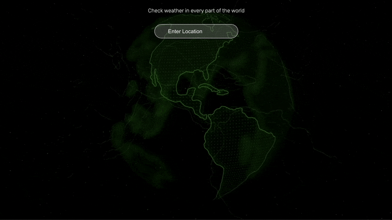

## ⛈️ WEATHER APP
A simple weather app coded as part of my frontend learning process.
It uses open API and allows you to check the weather in any city in the world.
I know ... so advanced 🤓
But it's one of my very firsts.

 ☝🏼video has been sped up to show quick sneak peek In the app background is more smooth. 🕴🏼

This project was bootstrapped with [Create React App](https://github.com/facebook/create-react-app).
### Available Scripts

In the project directory, you can run:

### `npm start`

Runs the app in the development mode.\
Open [http://localhost:3000](http://localhost:3000) to view it in your browser.

The page will reload when you make changes.\
You may also see any lint errors in the console.

### `npm run build`

Builds the app for production to the `build` folder.\
It correctly bundles React in production mode and optimizes the build for the best performance.

The build is minified and the filenames include the hashes.\
Your app is ready to be deployed!

See the section about [deployment](https://facebook.github.io/create-react-app/docs/deployment) for more information.

